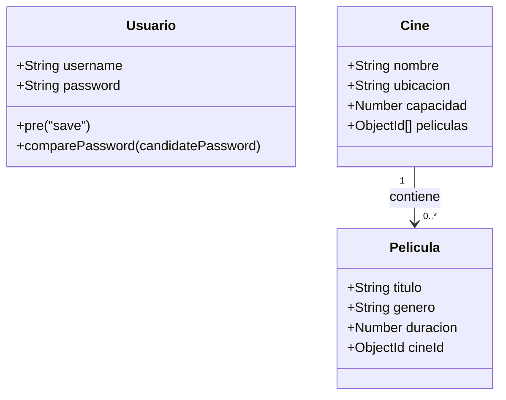
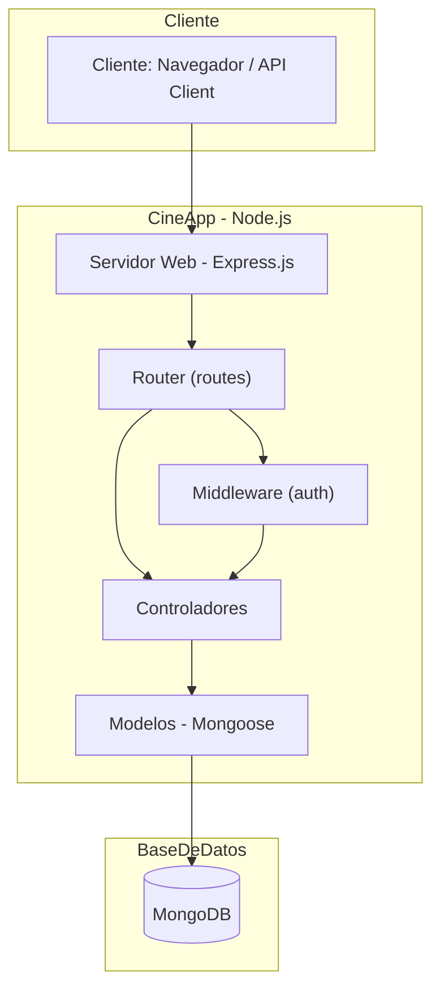

## 1️⃣ Diagrama de Clases  

```mermaid
classDiagram
    class Usuario {
        +String username
        +String password
        +pre("save")
        +comparePassword(candidatePassword)
    }

    class Cine {
        +String nombre
        +String ubicacion
        +Number capacidad
        +ObjectId[] peliculas
    }

    class Pelicula {
        +String titulo
        +String genero
        +Number duracion
        +ObjectId cineId
    }

    Cine "1" --> "0..*" Pelicula : contiene
```

---

## 2️⃣ Diagrama de Componentes  

```mermaid
flowchart TB
    subgraph Cliente
        C1["Cliente: Navegador / API Client"]
    end

    subgraph CineApp_Node [CineApp - Node.js]
        S1["Servidor Web - Express.js"]
        S2["Router (routes)"]
        S3["Middleware (auth)"]
        S4["Controladores"]
        S5["Modelos - Mongoose"]
    end

    subgraph BaseDeDatos
        DB[(MongoDB)]
    end

    C1 --> S1
    S1 --> S2
    S2 --> S3
    S2 --> S4
    S3 --> S4
    S4 --> S5
    S5 --> DB
```

